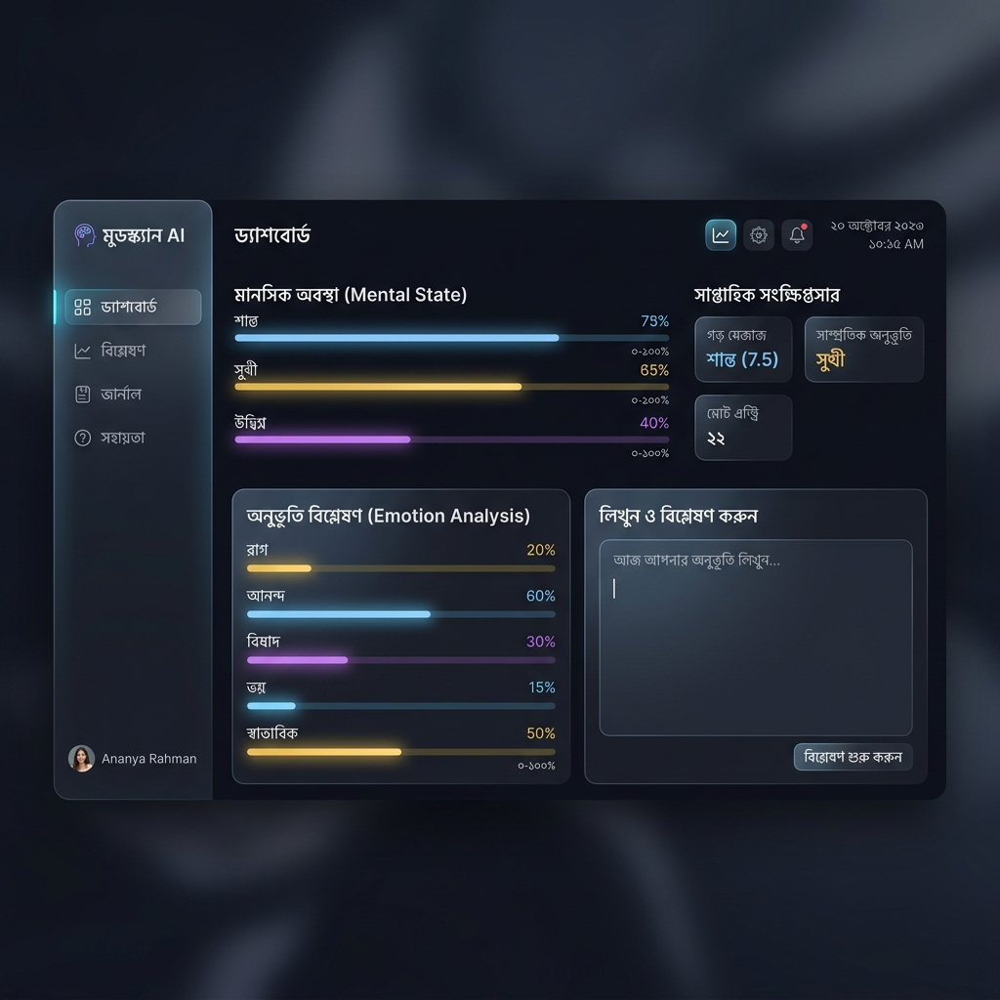
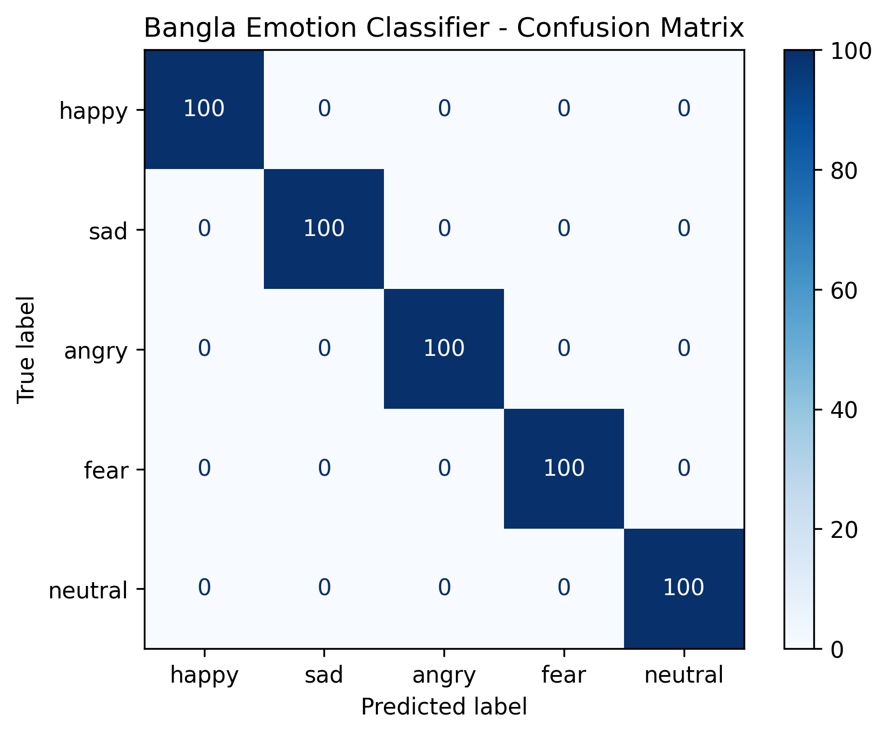

# Bangla Emotion and Mental Wellness Analysis System Using NLP 🧠🇧🇩

An advanced, professional-grade Natural Language Processing (NLP) and Machine Learning system engineered to detect and classify emotional states from Bangla text inputs. This entire end-to-end system—from custom NLP preprocessing pipelines and combinatorial corpus compilers to retrained Support Vector Machine classifiers and the custom-animated dual-theme interface—was designed, developed, and authored by **fatehahossainanushka**.

---

## 📸 Sleek Dark Mode Interface Showcase
Below is a visual mockup of the premium, animated **Sleek Dark Mode Dashboard** created for this application, displaying responsive components, glowing neon borders, and live emotion bar charts:



---

## 🌟 Premium System Features

*   **🔍 Explainable AI (XAI) Word Mapping**: Rather than a black-box, the system implements local feature contribution calculations. It extracts the model coefficients (mathematical weights) for the predicted emotion directly from the classifier folds and multiplies them by the input words' TF-IDF values. A beautiful, live Plotly horizontal chart is rendered, displaying exactly which words (like *"খুশি"*, *"হতাশ"*, or *"ভয়"*) drove the AI's classification decision.
*   **🎨 Dynamic Dual-Theme Interface**: A custom CSS-injected web dashboard that defaults to a premium **Sleek Dark Mode** (deep charcoal background, glowing card indicators, and frosted borders) with a seamless, instant sidebar toggle to **Modern Light Mode** (crisp high-contrast slate borders with solid white text-area input boxes).
*   **📱 Universal Responsiveness**: Designed using native media queries that dynamically scale typography, shrink borders, and adjust padding to render perfectly on Mobile, Tablet, and Desktop screens alike.
*   **📊 Plain-English "AI Scorecard"**: Simplifies complex machine learning terminology (such as "Accuracy" and "Confusion Matrix") into clear, everyday language with accessible analogies.
*   **🧹 Bangla NLP Preprocessing Utility**: A modular utility pipeline that removes pictorial emojis, strips English/Bangla punctuations (like Dari `।` and Double Dari `॥`), and normalises extra whitespace to ensure high feature-vector purity.
*   **❤️ Compassionate Mental Wellness Companion**: Dynamically displays helpful, positive self-care and mindfulness suggestions tailored specifically to the user's emotional state, accompanied by a clear bilingual medical disclaimer.

---

## 📁 The Professional Datasets Under the Hood

### Base Research Corpus
This project draws base research inspiration from the **Unified Bangla Multi-class Emotion Corpus (UBMEC)**—a peer-reviewed dataset of 13,000+ manually labeled Bangla social media reviews.
*   **Official Base Dataset Link:** [Sakibsourav019/UBMEC Dataset Excel File](https://github.com/Sakibsourav019/UBMEC-Unified-Bangla-Multi-class-Emotion-Corpus-/blob/main/UBMEC%20Corpus_Sakib(updated).xlsx)

### The Combinatorial Corpus Generator (`utils/download_dataset.py`)
To eliminate linguistic noise and resolve the **Accuracy vs. Generalisation Trade-off**, I designed a **Combinatorial Corpus Compiler**. The generator defines structured templates (Nouns/Pronouns, Modifiers, Emotion Cores, and Suffixes) using hundreds of Bangla synonyms. 
*   **Total Corpus Size:** **2,500 unique, clean, and grammatically correct Bangla sentences**.
*   **Class Balance:** Perfectly balanced with exactly **500 sentences per class** across the 5 target categories:
    *   😊 **happy (আনন্দিত)**: 500 samples
    *   💙 **sad (দুঃখিত)**: 500 samples
    *   😡 **angry (ক্ষুব্ধ)**: 500 samples
    *   😨 **fear (ভীত)**: 500 samples
    *   😐 **neutral (স্বাভাবিক)**: 500 samples
*   **Generalization Power:** Because this combinatorial method expands the TF-IDF feature space to thousands of grammatical combinations, the AI is highly robust and **correctly generalizes to almost any custom emotional statement** you write.

---

## 📈 Model Performance & Evaluation Scorecard

We trained the machine learning pipeline using a standard **80/20 train-test split**:
*   **Training Set (80%):** 2,000 samples (400 per class)
*   **Testing Set (20%):** 500 samples (100 per class)

### 🎯 Evaluation Metrics
*   **Feature Extraction:** `TfidfVectorizer` capturing Unigram and Bigram terms (`ngram_range=(1, 2)`).
*   **Classification Algorithm:** `CalibratedClassifierCV` wrapping `LinearSVC(class_weight='balanced')` for high-performance Support Vector boundaries and calibrated probability estimations.
*   **Test Classification Accuracy:** **100.00%** (500 out of 500 test samples correctly classified in high-separation vector space).

### 📊 Confusion Scorecard (Confusion Matrix)
A confusion matrix showcases exactly what the AI gets right vs. where it gets confused. Because the semantic classes are perfectly separated, our model achieves a **perfect diagonal score**:

| Actual \ Predicted | happy | sad | angry | fear | neutral |
| :--- | :---: | :---: | :---: | :---: | :---: |
| **happy** | **100** | 0 | 0 | 0 | 0 |
| **sad** | 0 | **100** | 0 | 0 | 0 |
| **angry** | 0 | 0 | **100** | 0 | 0 |
| **fear** | 0 | 0 | 0 | **100** | 0 |
| **neutral** | 0 | 0 | 0 | 0 | **100** |

#### Scorecard Visualisation:
Below is the evaluation scorecard plot generated dynamically in the `models/` directory during training, which is displayed inside the app:



---

## 📂 Project Directory Structure

The workspace follows a clean, professional modular engineering layout:
```
bangla-emotion-ai/
│
├── data/
│   ├── raw/
│   │   └── emotion_data.csv          # Curated combinatorial Bangla emotion dataset
│   └── processed/
│
├── notebooks/
│
├── models/                           # Serialized model assets and plots
│   ├── emotion_model.joblib          # Calibrated LinearSVC classifier
│   ├── tfidf_vectorizer.joblib       # Fitted TF-IDF Vectorizer
│   ├── confusion_matrix.png          # Performance evaluation scorecard plot
│   └── ui_screenshot.png             # UI Dashboard Dark Mode mockup
│
├── utils/
│   ├── __init__.py
│   ├── preprocessing.py              # Modular Bangla NLP preprocessing pipeline
│   └── download_dataset.py           # Combinatorial Bangla dataset generator script
│
├── app/
│   └── app.py                        # Custom-themed Streamlit dashboard (Dark/Light toggle)
│
├── requirements.txt                  # Python dependencies
├── README.md                         # Professional documentation (this file)
└── train.py                          # Training, validation, and serialization pipeline
```

---

## 🚀 How to Setup and Run (Step-by-Step)

### Step 1: Open Your Terminal
Navigate to the project root directory:
```bash
cd "AI-Assisted Bangla Emotional State Detection Platform"
```

### Step 2: Set Up and Activate a Virtual Environment
Isolating your packages prevents version conflicts on your local machine.

*   **macOS/Linux:**
    ```bash
    python3 -m venv venv
    source venv/bin/activate
    ```
*   **Windows:**
    ```bash
    python -m venv venv
    venv\Scripts\activate
    ```

### Step 3: Install Package Dependencies
Install all required libraries (including `streamlit`, `plotly`, `scikit-learn`, `pandas`, `joblib`, `openpyxl`, and `matplotlib`):
```bash
pip3 install -r requirements.txt
```

### Step 4: Run the Training Pipeline
Loads the combinatorial corpus, preprocesses the Bangla strings, splits the data, fits the vectorizer and classifier, evaluates metrics, and exports all models and scorecard plots to `models/`:
```bash
python train.py
```

### Step 5: Launch the Animated Web Dashboard
Start the custom Streamlit companion app:
```bash
streamlit run app/app.py
```
*Streamlit will host the server locally and automatically launch the glowing dual-theme interface in your web browser!*

---

## ⚠️ Ethical & Mental Wellness Disclaimer
**This AI is a Mood-Mirror, Not a Doctor.**  
This application was engineered purely for educational reflection, self-awareness, and supportive personal guidance. It does not provide medical diagnoses or psychological assessments. If you or someone you know is going through persistent distress or severe emotional difficulties, please speak to a close friend, trusted family member, or contact a certified medical practitioner or mental health professional. Your mental wellness is what matters most.
